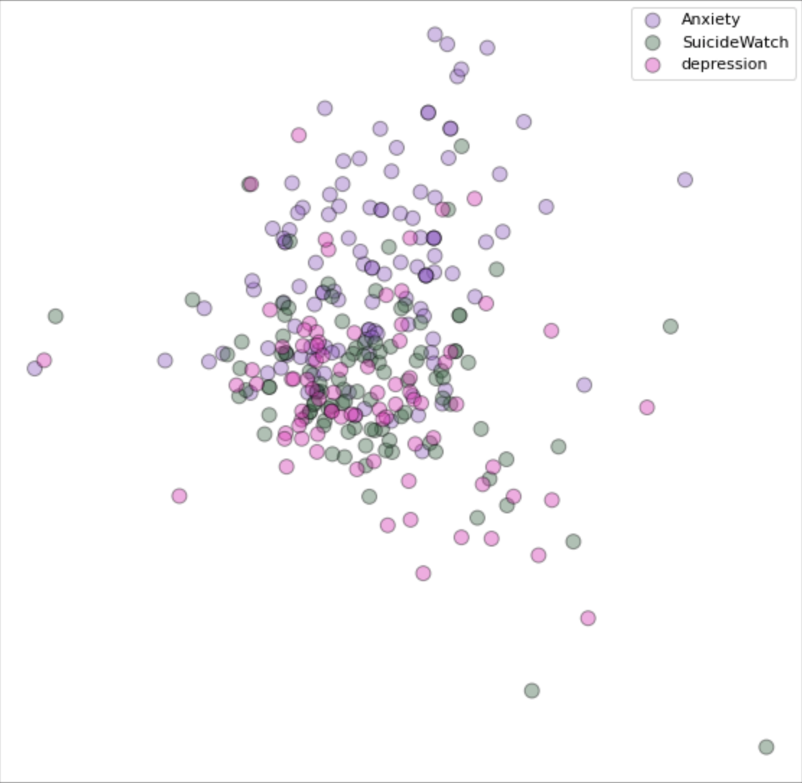
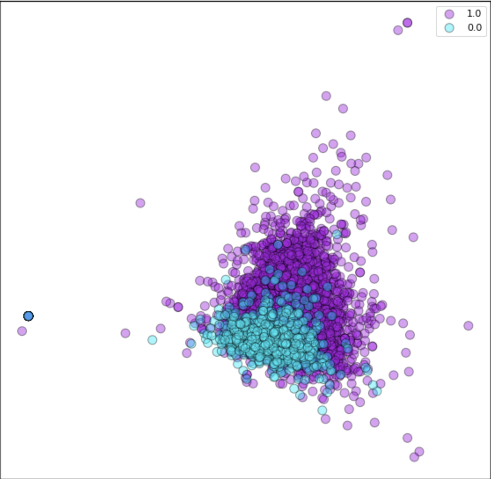

# Mental health and NLP fron Reddit

In this analysis, I have scraped posts from different subreddits and used the subreddit itself as the label for the post. Therefore, a post from r/depression will be labeled as "depression" and so on. This simplified approach leads to noisy labels as not every post in a subreddit is written in the same tone: it is very possible to find, in fact, positive posts even in subreddits like r/SuicideWatch, even though they are the minority. On top of the noisy labels problem, we have also to take into account that different mental issues are extremely correlated and, as such, treating categories like "depression", "anxiety", and "suicide" as separate categories is not optimal. 

After dimensionality reduction of the data, it appears extremely hard to separate between "depression" and "suicide" because, intuitively, the latter is part of the former. I was hoping to characterize "suicide" as a more extreme form of "depression", but because of noisy labels it is not possible to appreciate such relationship with this plot. The plot here shows a sample of the data.

Looking at the binary problem instead, the analysis becomes more straightforward and it is easier to divide the sub-populations, as shown by the plot (no sample, whole data).

## Analysis
In the notebook in this repo I play with the data as it is without really addressing the problems stated above. The goal of my analysis is to implement different NLP methodologies on the data and interpreting the results.

The NLP/ML methodologies implemented in this notebook are:
* Preprocessing of the data
* Language Models
  * Bag of Words (BOW)
  * TF-IDF
* Word Embeddings
* Dimensionality Reduction
* Author Topic Modelling
* Sentiment Analysis
* Classification Models
  * Most Frequent Classifier (baseline)
  * Logistic Regression
* Structured Prediction

